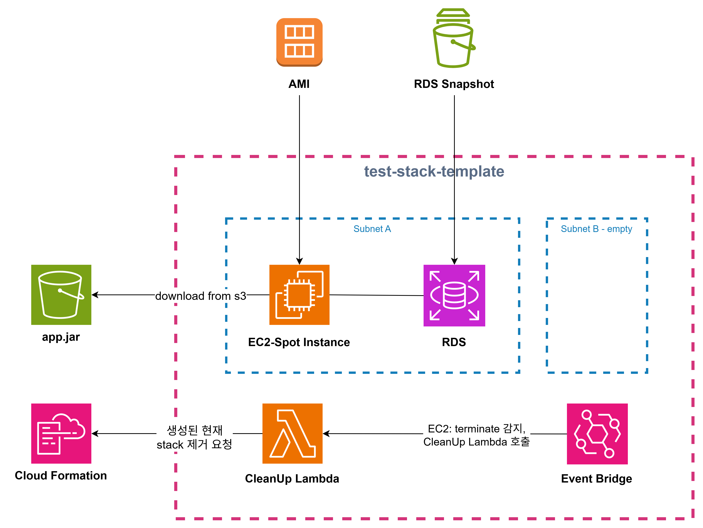
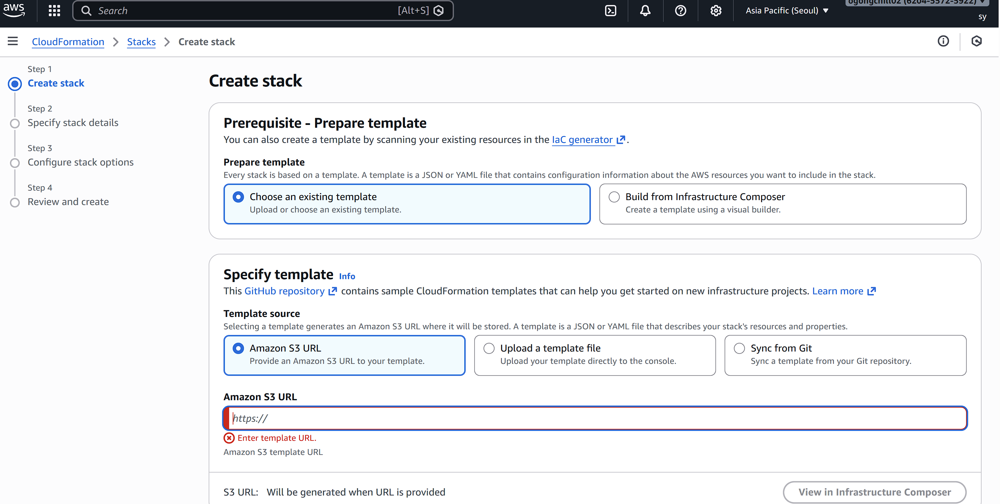
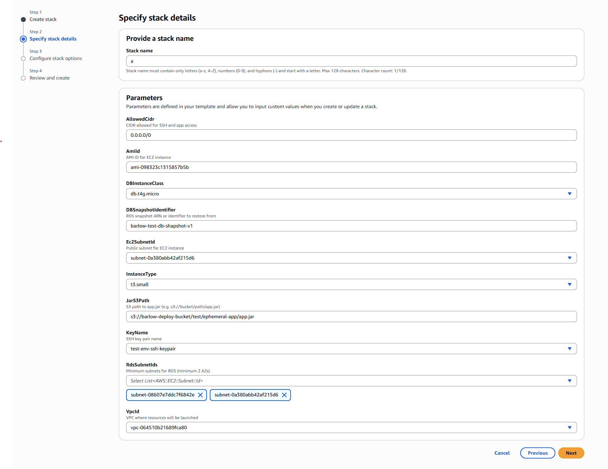
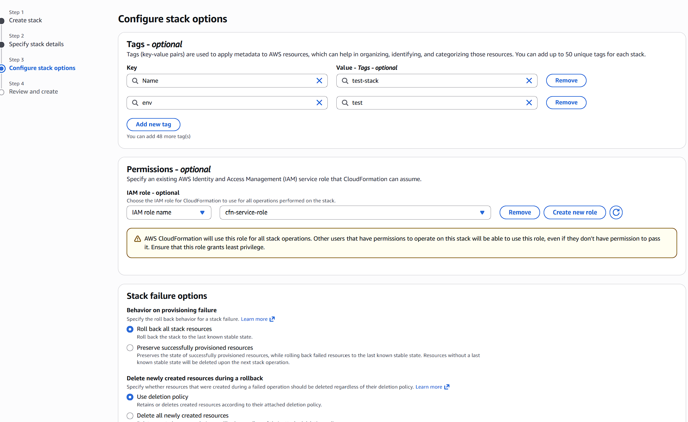
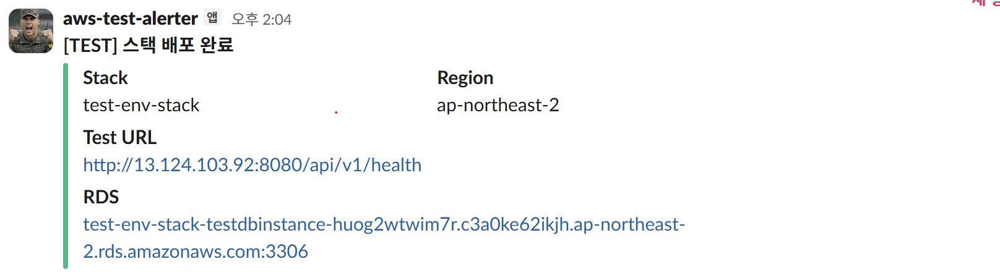

# Test Environment Stack

EC2 Spot인스턴스 1개와 + RDS 스냅샷 복원 기반의 단발성 테스트 환경입니다.
테스트 완료 후 EC2가 종료되면 스택 전체가 자동 삭제됩니다.

---

## 구성 리소스

| 리소스 | 설명 |
|--------|------|
| EC2 Spot Instance | Ubuntu, one-time spot, 종료 시 terminate |
| RDS MySQL | 스냅샷으로부터 복원, SingleAZ, PubliclyAccessible |
| EC2 Security Group | SSH(22), 앱(8080) 허용 |
| RDS Security Group | EC2 SG 및 외부에서 MySQL(3306) 허용 |
| EC2 IAM Role | S3 ReadOnly, CFN SignalResource, SSM GetParameter |
| CleanupLambda | EC2 종료 감지 시 스택 자동 삭제 |
| EventBridge Rule | EC2 `terminated` 상태 감지 → CleanupLambda 호출 |

테스트 환경에서는 rds와 ec2 모두 public subnet에 사용되며
테스트 환경의 기본 ec2 서브넷은

---

## 아키텍처


```

> **subnet-b가 비어있는 이유**: DBSubnetGroup은 최소 2개 AZ 서브넷을 요구합니다. EC2와 RDS는 동일 AZ(2a)에 배치해 크로스 AZ 통신 비용을 제거합니다.

> **Lambda self-deletion**: 현재 CleanupLambda는 스택 내부에 포함되어 자기 자신도 삭제합니다. 추후 Lambda를 스택 외부로 분리할 예정입니다.

> ec2는 ami에서, rds는 snapshot 을 통해 리소스를 복원하는 식으로 생성됩니다.


---


## 배포 흐름

```
스택 생성
  ├── RDS 스냅샷 복원 (5~10분)
  └── EC2 Spot 시작 (DependsOn: RDS)
        └── UserData 실행
              ├── 0. 환경변수 등록 (.profile override)
              │     - STORAGE_DATABASE_CORE_DB_URL=<rds-endpoint>:3306
              │     - JAR_S3_PATH=<s3-path>
              ├── 1. RDS 연결 대기
              ├── 2. S3에서 app.jar 다운로드
              ├── 3. deploy.sh 실행 (앱 기동)
              ├── 4. 헬스체크 (/health, 10초 간격 최대 30회)
              ├── 5. cfn-signal SUCCESS → 스택 완료
              └── 6. Slack 배포 완료 알림

EC2 종료 시 (Spot 회수 또는 수동)
  └── EventBridge → CleanupLambda → DeleteStack (전체 정리)
```

**참고사항**: 현재 deploy.sh와 같은 배포 스크립트는 AMI를 통해서만 관리되고 있습니다.(저장소에서 가져오는거 아님). 업데이트 필요.

### 실패 시 흐름

```
UserData 어느 단계에서든 오류 발생
  └── trap ERR 발동
        ├── cfn-signal FAILURE → 스택 롤백
        └── Slack 배포 실패 알림
```

---

## 파라미터

| 파라미터 | 필수 | 기본값 | 설명 |
|----------|------|--------|------|
| `VpcId` | 필수 | - | EC2/RDS를 배치할 VPC |
| `Ec2SubnetId` | 필수 | - | EC2용 퍼블릭 서브넷 |
| `RdsSubnetIds` | 필수 | - | RDS용 서브넷 (최소 2개 AZ) |
| `AmiId` | 필수 | - | Ubuntu 기반 AMI ID |
| `KeyName` | 필수 | - | SSH 키페어 이름 |
| `JarS3Path` | 필수 | - | `s3://bucket/path/app.jar` |
| `DBSnapshotIdentifier` | 필수 | - | RDS 스냅샷 ARN 또는 ID |
| `InstanceType` | 선택 | `t3.small` | `t3.micro` / `t3.small` / `t3.medium` |
| `DBInstanceClass` | 선택 | `db.t4g.micro` | `db.t4g.micro` ~ `db.t3.medium` |
| `AllowedCidr` | 선택 | `0.0.0.0/0` | SSH 및 앱 접근 허용 CIDR |

---

## 사전 조건

### AMI 구성 요구사항

AMI에 아래 항목이 사전 설치/설정되어 있어야 합니다.

| 항목 | 내용 |
|------|------|
| AWS CLI v2 | `aws s3 cp`, `aws cloudformation signal-resource` 사용 |
| netcat (`nc`) | RDS 포트 연결 확인 |
| JDK | `deploy.sh`에서 `java -jar` 실행 |
| `/home/ubuntu/barlow-server/deploy.sh` | 앱 기동 스크립트 |
| `/home/ubuntu/.profile` | 고정 환경변수 사전 등록 (JWT, OIDC 등) |

### SSM Parameter Store

| 파라미터 경로 | 타입 | 설명 |
|---------------|------|------|
| `/barlow/staging/slack-webhook-url` | SecureString | Slack Incoming Webhook URL |

```bash
aws ssm put-parameter \
  --name "/barlow/staging/slack-webhook-url" \
  --value "https://hooks.slack.com/services/..." \
  --type SecureString
```

### cfn-service-role 필요 권한

스택 배포 시 사용하는 CFN 서비스 롤에 아래 권한이 필요합니다.

- `ec2:*`
- `iam:CreateRole`, `iam:DeleteRole`, `iam:PutRolePolicy`, `iam:DeleteRolePolicy`, `iam:AttachRolePolicy`, `iam:DetachRolePolicy`, `iam:PassRole`, `iam:TagRole`, `iam:*InstanceProfile*`
- `rds:*`
- `lambda:CreateFunction`, `lambda:DeleteFunction`, `lambda:TagResource`, `lambda:AddPermission`, `lambda:RemovePermission`
- `events:PutRule`, `events:DeleteRule`, `events:PutTargets`, `events:RemoveTargets`, `events:TagResource`

---

## Outputs

| 키 | 설명 |
|----|------|
| `InstanceId` | EC2 인스턴스 ID |
| `PublicIp` | EC2 퍼블릭 IP |
| `TestUrl` | 테스트 서버 URL (`http://<ip>:8080/health`) |
| `RDSEndpoint` | RDS 엔드포인트 주소 |
| `RDSPort` | RDS 포트 |

---

## 환경변수 흐름

```
AMI .profile (사전 등록)
  - JWT_CRYPTO_PRIVATE_KEY
  - JWT_CRYPTO_PUBLIC_KEY
  - KAKAO_OIDC_*
  - STORAGE_DATABASE_CORE_DB_URL=localhost:3306  ← UserData에서 override

UserData (런타임 주입)
  - STORAGE_DATABASE_CORE_DB_URL=<rds-endpoint>:3306  ← .profile에 append (override)
  - JAR_S3_PATH=<s3-path>

deploy.sh
  └── source ~/.profile → 모든 환경변수 로드 → java -jar 실행
```

## 현재 사용중인 것

### AMI
- test-env-ami id:`ami-098323c1315857b5b`
현재 실행중인 t3.micro의 snapshot버전.
ami 내부에는
```
- ubuntu 22 LTS
- open jdk 21
- aws-cli/1.22.34 Python/3.10.12
- gardle 8.1
- prometheus 3.2.1
```
이 설치되어 있습니다.

### DB SNAPSHOT
db의 경우 rds snapshot > 복구 의 형식으로 생성합니다.
- `test-db-snapshot-v1` : 현재 사용중인 테스트 db로 스키마 정도만 구성되어 있습니다. Intellij에서 DDL 추출한거라 실제 DB의 제약 조건 등과 조금 상이 할 수 있습니다.

만약 스키마를 수정해야 한다면 snapshot에서 `복원 > 수정 > 새로운 snapshot 생성` 을 통해 새로운 snapshot으로 스택 배포가 가능합니다.

만약 데이터 셋이 필요하다면 배포 이후 수동으로 넣어야 합니다.

## Template

- test-stack-template.yml은 현재 `barlow-deploy-bucket`의 `templates/test/test-stack-template.yml` 에 위치하고 있으며 현재 git 저장소와 동기화되어 있습니다.


---

## 배포 방법

2026.2.20 ver

아래의 내용은 aws 콘솔에서 수동으로 배포하는 방법입니다.

1. Cloud Formation에서 Stack을 생성합니다. 템플릿의 objectUrl을 넣습니다.
`https://barlow-deploy-bucket.s3.ap-northeast-2.amazonaws.com/templates/server/test/test-stack-template.yml`


2. 환경을 구성합니다.

- `StackName` : 생성할 stack의 이름
- `AmiId`: ec2를 생성하기 위한 ami snapshot입니다.
  - EC2 > AMIs 에서 확인 할 수 있으며 `test-env-ami`를 사용합니다.
- `DBInstanceClass`: rds 사양을 선택합니다.
  - 기본으로 t4g.micro입니다
- `DBSnapshotIdentifier`: 사용하고자 하는 rds snapshot 이름입니다. 테스트 환경에서는 `barlow-test-db-shapshot-v1` 을 사용 할 수 있습니다.

- `Ec2SubnetId`: ec2가 배포될 서브넷을 지정합니다.
  -`default-prod-public-subnet`: 현재 배포 인스턴스가 속해있는 subnet
  - `test-subnet-2a` : 테스트 환경을 위한 서브넷. ap-northeast-2의 a 가용역역(az)에 위치
  - `public-subnet-2b`: 테스트 환경을 위한 서브넷. ap-northeast-2의 b 가용역역(az)에 위치. db subnet group의 서로 다른 az 가용영역 요구사항을 위한 서브넷.

- `InstanceType`: 인스턴스 사양. t3.micro ~ medium

- `JarS3PAth`: 빌드 아티팩트가 위치한 s3 uri.
  - `s3://barlow-deploy-bucket/test/ephemeral-app/app.jar` 과 같은 s3url 형식.
  - userdata를 통해 실행시 이 위치에서 jar를 받아 deploy.sh를 실행합니다.

- `RdsSubnetIds`: Rds를 생성하기 위한 서브넷설정.
  - RDS는 SubnetGroup을 요구. SubnetGroup은 서로다른 가용영역(az)의 서브넷을 요구합니다.
  - `public-subnet-2b`, `test-subnet-2a` 를 지정합니다.

- `VPCId`: defaultVPC를 선택하여 지정합니다.


3. 동작 설정


- Tag(optional이지만 웬만하면 할것)
  - `Name`: 생성된 stack의 Name
  - `env`: `test`, `prod`, `common` 중 하나 선택. 
  - aws config에서 리소스 별 태그로 식별 가능. 추후 event listener를 통해 test env stack은 주기적으로 감지해서 삭제할 예정(비용 절감)
- `Stack Failure options`
  - Behavior on provisioning failure : Roll back all stack resources > 비용절감, 실패시 생성된 항목 모두 롤백.
  - Delete newly created resources during rollback : Use deletion policy > 템플릿의 deletion policy에 따라 동작

4. 이후



스택 배포가 완료되었다면 slack `#서버-테스트-알림` 채널에 알림.
생성된 ec2의 public ip와 rds 주소를 확인 가능합니다.
실패시도 알림.

5. 기